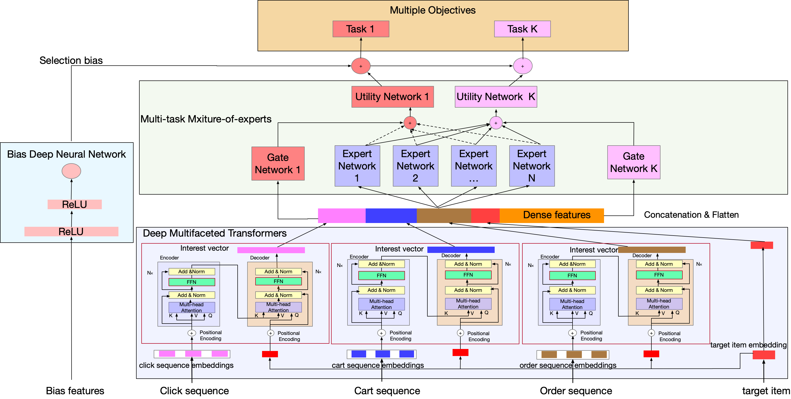

Deep Multifaceted Transformers for Multi-objective Ranking in Large-Scale E-commerce Recommender Systems (CIKM 2020)
============

# DMT:

   DMT_code is the code for the paper "[Deep Multifaceted Transformers for Multi-objective Ranking in Large-Scale E-commerce Recommender Systems](https://dl.acm.org/doi/abs/10.1145/3336191.3371827)", which is published in CIKM 2020. 



## Requirements

python==2.7

tensorflow==1.12

## Usage

```sh run.sh```

# Datasets:

  JD Recsys Dataset.

## Statistics:

| Type  | Total Sampled | Impressions | Clicks     | Orders    |
| ----- | ------------- | ----------- | ---------- | --------- |
| Train | 667,907,650   | 622,596,211 | 43,876,602 | 1,434,837 |
| Test  | 105,444,671   | 98,732,799  | 6,477,409  | 234,463   |

## Download link:

The dataset can be downloaded from: https://drive.google.com/drive/folders/1Dnlnnzl2QD2mYP3o0icSxNVrl6nCvlT0?usp=sharing. The files are in the format of TFRecord and can be placed in HDFS for training.

The shared dataset is sampled from the 0.7 billion dataset used in the paper.

## Description:

The datasets are used in "Deep Multifaceted Transformers for Multi-objective Ranking in Large-Scale E-commerce Recommender Systems", which is published in CIKM 2020.

## Research Topics:

This dataset can be used for research on CTR prediction, CVR prediction, multi-task ranking, sequential modeling, unbiased ranking in Recommender Systems. This dataset should only be used for research purpose!

## Citation:

Please cite the following paper if you use the data in any way.

```
@inproceedings{gu2020dmt,
  title={Deep Multifaceted Transformers for Multi-objective Ranking in Large-Scale E-commerce Recommender Systems},
  author={Gu, Yulong and Ding, Zhuoye and Wang, Shuaiqiang and Zou, Lixin and Yiding Liu and Yin, Dawei},
  booktitle={CIKM'20},
  year={2020}
}
```


## File Description:

The dataset files are in the format of TFRecord.

Each line in the TFRecord files contains the ranking features and label in the Recommender System.


The ranking features contains 615 dense features and some id features.

The labels are impressions (labels=0), clicks (labels=1 or 2) and orders (labels=4 or 5).

| feature type         | name                  | desc                                                         |
| -------------------- | --------------------- | ------------------------------------------------------------ |
| Dense features       | features              | 615 dimension dense features. They contain item profile features (e.g.,number of clicks, CTR, CVR, rating) , use profile features (e.g.,prefered categories and brands, purchase power), user-item matching features (e.g.,whether the item matches the user’s gender or age) and user-item interaction features (e.g.,number of clicks on thecategory of the item within a time window). |
| Categorical features | item_fea_sku          | id of the product                                            |
|                      | item_c2               | second level category id of the product                      |
|                      | item_c3               | third level category id of the product                       |
|                      | item_brand            | brand id of the product                                      |
|                      | item_shop             | shop id of the product                                       |
| clk_seq              | clk_seq_sku_7d_50     | sequence of ids of the products in the click sequence (latest 50 clicks in recent 7 days) |
|                      | clk_seq_ts_7d_50      | sequence of timestamps in the click sequence (latest 50 clicks in recent 7 days) |
|                      | clk_seq_c2_7d_50      | sequence of second level category ids in the click sequence (latest 50 clicks in recent 7 days) |
|                      | clk_seq_c3_7d_50      | sequence of third level category ids in the click sequence (latest 50 clicks in recent 7 days) |
|                      | clk_seq_brand_7d_50   | sequence of brand ids in the click sequence (latest 50 clicks in recent 7 days) |
|                      | clk_seq_shop_7d_50    | sequence of shop ids in the click sequence (latest 50 clicks in recent 7 days) |
| ord_seq              | ord_seq_sku_12m_50    | sequence of ids of the products in the purchase sequence (latest 50 orders in recent 12 months) |
|                      | ord_seq_ts_12m_50     | sequence of timestamps in the purchase sequence (latest 50 orders in recent 12 months) |
|                      | ord_seq_c2_12m_50     | sequence of second level category ids in the purchase sequence (latest 50 orders in recent 12 months) |
|                      | ord_seq_c3_12m_50     | sequence of third level category ids in the purchase sequence (latest 50 orders in recent 12 months) |
|                      | ord_seq_brand_12m_50  | sequence of brand ids in the purchase sequence (latest 50 orders in recent 12 months) |
|                      | ord_seq_shop_12m_50   | sequence of shop ids in the purchase sequence (latest 50 orders in recent 12 months) |
| cart_seq             | cart_seq_sku_12m_10   | sequence of ids of the products in the cart sequence (latest 10 carts in recent 12 months) |
|                      | cart_seq_ts_12m_10    | sequence of timestamps in the cart sequence (latest 10 carts in recent 12 months) |
|                      | cart_seq_c2_12m_10    | sequence of second level category ids in the cart sequence (latest 10 carts in recent 12 months) |
|                      | cart_seq_c3_12m_10    | sequence of third level category ids in the cart sequence (latest 10 carts in recent 12 months) |
|                      | cart_seq_brand_12m_10 | sequence of brand ids in the cart sequence (latest 10 carts in recent 12 months) |
|                      | cart_seq_shop_12m_10  | sequence of shop ids in the cart sequence (latest 10 carts in recent 12 months) |
| Bias features        | near_expo_seq_c2      | sequence of second level category ids of the neighboring exposured products of the product |
|                      | near_expo_seq_c3      | sequence of third level category ids of the neighboring exposured products of the product |
|                      | page               | page number of the product exposed in the page               |
|                      | position           | position number of the product exposed in the page           |

